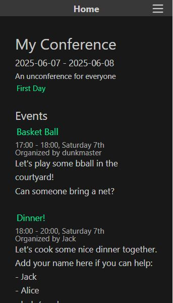

# Unconference Calendar App for Webxdc

The unconference format needs a webxdc calendar! Scheduling and advertizing various events in a permissionless way.



**This project is mostly for me to learn p2p stuff like [CRDTs](https://mattweidner.com/2023/09/26/crdt-survey-1.html) and [webxdc](https://webxdc.org) basics.**

## Desired Features
- Initiator defines a time range of one or more days.
- Anyone can create events in the form of a time range, title, description and an organizer field.
- Probably calendar and list views, some decent way to show whats happening in parallel.

Stretch goals:
- Add attendence counting via a "i'm going" button for each event per user.
- Allow placeholder / marker events to let organizers block out sections of time. e.g. "Lunch Break" between 12:00 and 14:00, disallow attendence and color different in UI
- Favoriting events to put them in a shortlist, like CCC?

## Tech Approach
My first draft will be a naive last write wins DB. A simple "create event" message with some required fields will insert one into our localstorage with a UUID. later "update event" messages will update whatever optional fields have been provided.

Probably will use react or something for the frontend, maybe not and reloading the state a window a lot is ok?

```js
// OPERATIONS
{
  type: "conference",
  action: "create",
  fields: {
    start: "2025-03-25T12:00:00",
    end: "2025-06-25T14:00:00",
    title: "Forest Occupation of Anarchist Veternarians",
  }
}

{
  type: "event",
  action: "create",
  fields: {
    id: "36b8f84d",
    start: "2025-04-25T12:00:00",
    end: "2025-04-25T14:00:00",
    title: "DIY Equestrian First Aid",
    description: "Let's get those ponies their medicine!",
    organizer: "Jay"
  }
}

{
  type: "event",
  action: "update",
  fields: {
    id: "36b8f84d",
    start: "2025-04-25T12:00:00",
    end: "2025-04-25T16:00:00",
    organizer: "Jay and Kay"
  }
}

```

### Problems
- Timezones suck, lets skip this for now and assume unconferences happen in an obvious shared context. Version 2 can have a default timezone for the conference as a whole and give users a toggle to go between their own and the conference's.
- Some level of permissions might be desirable. Or at least if someone deleted your event it'd be nice to have a notification?
- Updating the conference dates might leave events outside the acceptible range. We'd need a way of still seeing these without advertizing them so directly.


### Progress Checklist

- [x] Vue frontend
- [x] Wrap webxdc connection in vue store
- [x] Core operation CRDTs
- [x] Conference and Event types, operations
- [x] Event deletion
- [x] Day-by-day view
- [ ] Add localstorage logic to appstore, resume update listening from last sequence 

Maybe suff
- [ ]deep links for chat from creation events
- [ ] Decide on themining and dump placeholder CSS
- [ ] Attendence type, for marking interest in a specific event
